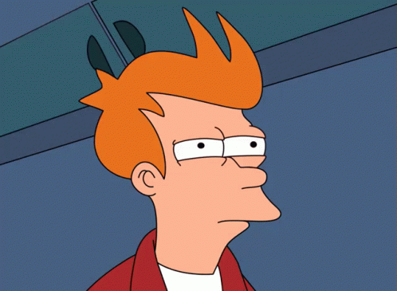
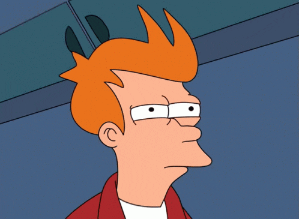

# makeAgifBoomerang

Un script bien simple pour faire boucler un GIF sur lui même en le passant à reculon

## Dépandance

- ffmpeg
- gifski

## Comment l'utiliser

`./makeAgifBoomerang.sh <TonGif.gif> [frame de début] [frame depuis la fin] [fps]`
Remplace `TonGif.gif` par le nom de ton image.

`[frame de début]` Défaut à 0; correspond à l'index du frame de départ.

`[frame depuis la fin]` Défaut à 0; correspond à l'index du frame de fin depuis la fin de l'image. Si le gif à 30 images, si l'option est défini à 5, le dernier frame sera le 25e (30-5).

`fps` Défaut à 20; est le nombre d'image par seconde du résultat.

Le fichier résultant sera nommé selon le fichier initial plus le frame initial, final et fps exemple: `exemple_2-15-30.gif`

Donc avec la commande `./makeAgifBoomerang..sh exemple.gif 2 15 30` on passe de

Deviendra

